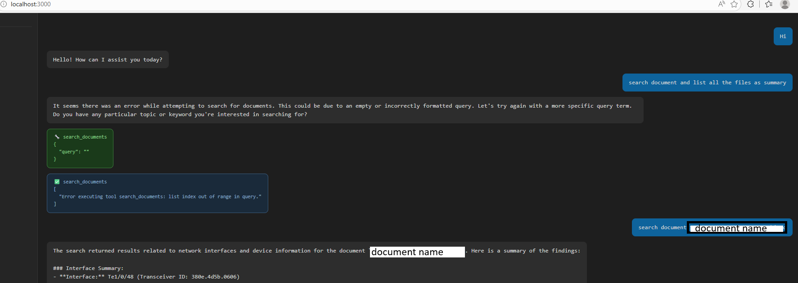

# rag-demo

A RAG (Retrieval-Augmented Generation) application that indexes your documents and lets you chat with them via a browser UI. Built with ChromaDB for vector storage, Ollama for local LLM inference, and Node.js as the web server.

## How It Works

```
Your Documents (PDF/TXT/MD)
        │
        │ index / embed
        ▼
   ChromaDB (vector store)
        │
        │ similarity search
        ▼
  Relevant chunks + your question
        │
        │ prompt
        ▼
   Ollama (local LLM)
        │
        │ answer
        ▼
  Browser Chat UI (:3000 via server.js)
```

## Features

- Index local documents (PDF, TXT, Markdown) into ChromaDB
- Chat with your documents via a browser UI
- Fully local — no OpenAI API key needed
- Powered by Ollama (qwen2.5:7b or any local model)
- ChromaDB for fast vector similarity search
- Node.js web server with streaming responses

---

## Prerequisites

- Python 3.10+
- Node.js 18+
- [Ollama](https://ollama.com) installed and running
- ChromaDB (installed via pip)

---

## Quick Start

### 1. Clone the repo

```bash
git clone https://github.com/KrishnaMuddala/rag-demo.git
cd rag-demo
```

### 2. Install Python dependencies

```bash
pip install -r requirements.txt
# or
pip install chromadb ollama langchain
```

### 3. Install Node.js dependencies

```bash
npm install
```

### 4. Start Ollama and pull a model

```bash
ollama serve
ollama pull qwen2.5:7b
```

### 5. Add your documents

Place your documents (PDF, TXT, MD) in the `documents/` folder:

```
rag-demo/
└── documents/
    ├── my-doc.pdf
    ├── notes.txt
    └── guide.md
```

### 6. Index your documents

```bash
python index.py
```

This embeds your documents and stores them in ChromaDB.

### 7. Start the web server

```bash
node server.js
```

Open [http://localhost:3000](http://localhost:3000) and start chatting with your documents.

---

## Usage

**Index new documents:**
```bash
python index.py
```

**Start the chat UI:**
```bash
node server.js
```

**Ask questions in the browser:**
```
What is this document about?
Summarize the key points from the guide
Find information about X in my documents
```

---

## Project Structure

```
rag-demo/
├── server.js          # Node.js web server — chat UI on :3000
├── index.py           # Document indexing script — embeds into ChromaDB
├── documents/         # Place your documents here (PDF, TXT, MD)
├── chroma_db/         # ChromaDB vector store (auto-created on index)
├── package.json       # Node.js dependencies
├── requirements.txt   # Python dependencies
└── .env               # Configuration (model, ports, paths)
```

---

## Configuration

Create a `.env` file in the project root:

```env
# Ollama
OLLAMA_BASE_URL=http://localhost:11434
OLLAMA_MODEL=qwen2.5:7b
OLLAMA_EMBED_MODEL=nomic-embed-text

# ChromaDB
CHROMA_PATH=./chroma_db
CHROMA_COLLECTION=documents

# Server
PORT=3000
```

---

## Dependencies

### Python
| Package | Purpose |
|---|---|
| `chromadb` | Vector store for document embeddings |
| `ollama` | Local LLM inference |
| `langchain` | Document loading and text splitting |

### Node.js
| Package | Purpose |
|---|---|
| `express` | Web server |
| `axios` | HTTP requests to Python/Ollama |

---

## Troubleshooting

**Ollama not running**
```bash
ollama serve
ollama list    # confirm model is pulled
```

**ChromaDB collection empty**
```bash
python index.py   # re-run indexing
```

**Documents not found**
Make sure your files are in the `documents/` folder before running `index.py`.

**Port already in use**
```bash
# Change PORT in .env
PORT=3001
node server.js
```
## Demo document search MCP server


*MCP Chat running with qwen2.5:7b via Ollama on Windows*
---

## License

MIT
